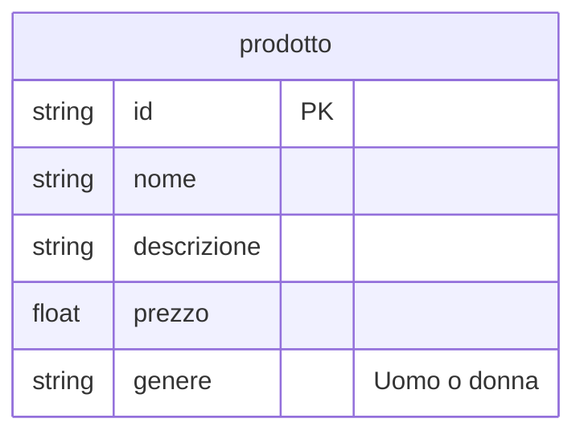
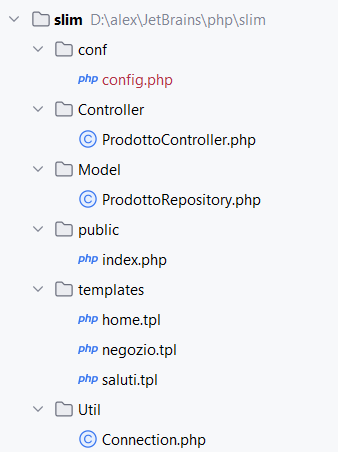

# Struttura di applicazioni complesse

Nelle applicazioni viste finora, la gestione di *cosa fare* in base al differente tipo di richiesta (GET, POST)
e dei parametri ricevuti, veniva gestita da un unico file, contenente una serie di `if`, ma, anche con poche 
e semplici funzionalità, tendeva a intricarsi velocemente. 

Per gestire meglio l'organizzazione di applicazioni di media complessità, senza aver la pretesa di utilizzare
librerie complete ma anche decisamente più complesse, si vedrà come utilizzare Slim e se ne fornirà
una proposta di come strutturare applicazioni con accesso a database e con presenza di più funzionalità.

## Cos'é Slim
Il sito di Slim definisce la libreria in questo modo

> Slim is a PHP micro framework that helps you quickly write simple yet powerful web applications and APIs.
> At its core, Slim is a dispatcher that receives an HTTP request, invokes an appropriate callback routine
> and returns an HTTP response. That’s it.

Quindi il nocciolo di quello che fa è di ricevere le richieste HTTP, *agganciarle* all'azione appropriata
e ritornare la corretta risposta HTTP. 


## Come creare la prima applicazione in Slim

Per informazioni più dettagliate si veda il sito di riferimento: [Slim](https://www.slimframework.com/docs/v4/)

### Come installare

Utilizzando Composer[^composer-proxy] bisogna installare nel proprio progetto la libreria `Slim`

[^composer-proxy]: Nei laboratori dove è presente il proxy, è necessario operare con Fiddler come si è fatto in altre occasioni

```bash
composer require slim/slim:"4.*"
```

Successivamente è necessario un altro componente per gestire le richieste, che va installato sempre con Composer.

```bash
composer require slim/psr7
```


A questo punto creare nel progetto una cartella *public* e al suo interno inserire il file *index.php*, che diventerà il front-controller dell'applicazione, cioè ogni richiesta passerà attraverso di lui.

Il contenuto di questo file può essere popolato in questo modo

```php
<?php
use Psr\Http\Message\ResponseInterface as Response;
use Psr\Http\Message\ServerRequestInterface as Request;
use Slim\Factory\AppFactory;

require __DIR__ . '/../vendor/autoload.php';

$app = AppFactory::create();

//Questa parte deve contenere il percorso della
//sottocartella dove si trova l'applicazione in questo caso inserito nella
//variabile di configurazione BASE_PATH
$app->setBasePath('/template_slim');

$app->get('/', function (Request $request, Response $response, $args) {
    $response->getBody()->write('Hello world!');
    return $response;
});

$app->get('/altra_pagina', function (Request $request, Response $response, $args) {
    $response->getBody()->write('Questa è un\'altra pagina');
    return $response;
});

$app->run();
```

Le parti più importanti di questo codice sono:
1. la variabile `$app` rappresenta l'applicazione ed è quella che verrà usata per creare tutte le associazioni rotta - azione
2. per ogni rotta che si intende gestire, che in questo esempio sono la rotta "vuota" `/` e la rotta `/altra_pagina`, deve essere chiamato un metodo che mappa la richiesta HTTP che si intende utilizzare (GET, POST, ...) e nel quale vanno passati come parametri la rotta e l'azione da associare, sotto forma di funzione anonima. In questo esempio viene utilizzato per entrambe il metodo `get` e quindi una GET sulla rotta vuota produrrà una pagina con la scritta `Hello world` e una GET sulla rotta `/altra_pagina` produrrà la scritta `Questa è un'altra pagina`.
3. I parametri della funzione anonima sono tre e rappresentano nell'ordine l'oggetto che contiene le informazioni della richiesta (`$request`), quello che conterrà le informazioni della risposta (`$response`) e un vettore (`$args`) che conterrà eventuali parametri contenuti nella rotta (si veda l'esempio con i template)
4. Nel corpo della funzione avviene la scrittura del body della risposta, utilizzando il metodo `write` applicato appunto al body e scrivendo quello che si vuole sia contenuto nella pagina di risposta (**attenzione**: il body della risposta è quello relativo al protocollo HTTP, non ha nulla a che vedere con il body della pagina HTML, hanno solo lo stesso nome).


**Attenzione**: il parametro nella chiamata al metodo ```setBasePath``` deve rispecchiare l'esatta struttura delle cartelle dove si trova l'applicazione. In questo esempio il metodo viene chiamato in questo modo
```php
$app->setBasePath("/template_slim");
```
perché l'applicazione si trova nella sottocartella *template_slim* all'interno della root del web server. Se ad esempio la cartella si trovasse nella cartella *~piero/negozio* allora l'istruzione andrebbe riscritta come
```php
$app->setBasePath("/~piero/negozio");
```

## Configurare Apache per l'URL rewriting

In un'applicazione web è una buona idea avere un solo *front-controller*, cioè un unico file, nel nostro caso `index.php`, a cui arrivano tutte le richieste HTTP, indipendentemente dalla *rotta* effettiva della richiesta: quindi richieste indirizzate ad esempio a `/negozio/accessori` piuttosto che ad
`/admin/` passeranno comunque attraverso il file `index.php`, che
si occuperà del *dispatching*, della *distribuzione*, al pezzo di 
codice che dovrà gestire ogni particolare richiesta.

Se quindi l'applicazione ha bisogno che tutte le richieste HTTP arrivino al file *index.php*, è necessario istruire il web server per fare in modo che ogni richiesta che arriva, indipendentemente dall'URL effettivo, venga dirottata sul file `index.php`.

Usando Apache presente in Xampp bisogna seguire questi passi:
- abilitare il modulo di URL rewriting. Per far questo aprire con un editor di testo (anche PHPStorm va bene) il file ```directory_di_xampp/apache/conf/httpd.conf``` e controllare se la riga
```apacheconf
LoadModule rewrite_module modules/mod_rewrite.so
```
ha un **#** davanti. Se così fosse va eliminato e altrettanto va
fatto per la riga
```apacheconf
LoadModule actions_module modules/mod_actions.so
```

A questo punto bisogna far partire o ripartire Apache e la configurazione
dovrebbe essere corretta (per ulteriori informazioni consultare [questa pagina](https://www.slimframework.com/docs/v4/start/web-servers.html) oppure Google).

Infine, per fare in modo che tutte le richieste vengano dirottate sul file `index.php` che si trova nella cartella `public`[^cartella_public] bisogna aggiungere nella cartella
principale, *template_slim* in questo esempio, un file *.htaccess* con il seguente contenuto:
```apacheconf
RewriteEngine On

RewriteRule ^ public/index.php [QSA,L]
```

[^cartella_public]: Il motivo per il quale il file `index.php` viene inserito nella cartella `public` e non nella root del progetto
è legato alla sicurezza dell'applicazione, anche se qui non verrà approfondito questo tema.

Adesso dovrebbe essere sufficiente inserire l'indirizzo ```localhost/template_slim``` (o quello relativo a dove si è deciso
di mettere l'applicazione) nella barra degli indirizzi del browser e dovrebbe apparire una pagina con la scritta **Hello world**. Per ulteriore conferma provare a inserire ```localhost/slim/altra_pagina``` e dovrebbe comparire il testo **Questa è un'altra pagina**.

## Gestione degli errori
Slim prevede già un meccanismo di gestione degli errori/eccezioni con un proprio Middleware[^middleware] e per attivarlo è sufficiente introdurre questa riga di codice

```php
$errorMiddleware = $app->addErrorMiddleware(true, true, true);
```

[^middleware]: Per *middleware* in questi contesti si intende uno strato di software che si interpone tra la richiesta dell'utente e l'applicazione 
vera e proprio, per svolgere delle funzionalità che sono comuni a 
moltissime applicazioni e che, quindi, possono essere riutilizzate
senza bisogno di particolari modifiche. Esempi di middleware sono appunto la gestione delle eccezioni e l'autenticazione.

Di default il comportamento è quello di intercettare errori/eccezioni e mandare in risposta una pagina HTML con le informazioni sul problema, eventualmente con anche i dettagli dello stack di chiamate nel caso il 
primo parametro fosse uguale a ```true```, come nell'esempio qua sopra. Gli altri due parametri sono rilevanti solo se si utilizza un meccanismo di *logging*, per maggiori informazioni fare riferimento 
alla [documentazione ufficiale](https://www.slimframework.com/docs/v4/middleware/error-handling.html).

## Utilizzare Plates
Volendo utilizzare la libreria di templates Plates, come già fatto in precedenza, dovrà essere
importata con il solito comando
```bash
composer require league/plates
```
e nel codice andrà indicata con 
```php
use League\Plates\Engine;
```

ed è poi buona cosa utilizzare un [Dipendency Injector](https://en.wikipedia.org/wiki/Dependency_injection) per utilizzarla all'interno di Slim. Senza dilungarsi sul concetto
di Dipendency Injection, lo scopo è quello di separare in maniera pulita un servizio (in questo caso
Plates) dall'applicazione vera e propria che utilizzerà quel servizio.
In pratica per ottenere lo scopo bisogna prima importare una libreria che implementi il meccanismo
di DI, e Slim suggerisce di utilizzare PHP-DI, e con Composer si fa

```bash
composer require php-di/slim-bridge:* --with-all-dependencies
```

Fatto questo, basterà aggiungere nel codice la creazione del Container, che poi dovrà essere
passato all'applicazione

```php
$container = new Container();
//da inserire prima della create di AppFactory
AppFactory::setContainer($container);
```

Per aggiungere dei servizi al container è sufficiente usare il metodo ```set```, che nel caso specifico
di Plates verrà fatto in questo modo

```php
$container->set('template', function (){
    $engine = new Engine('../templates', 'tpl');
    $engine->addData(['base_path' => BASE_PATH]);
    return $engine;
});
```
dove il primo parametro è la chiave per recuperare il servizio e il secondo è la funzione anonima
che ritorna il servizio, occupandosi della sua creazione. 

**Attenzione**: il primo parametro del costruttore dell'Engine deve come al solito contenere la cartella
dove poi verranno inseriti i vari template, ma il percorso deve essere relativo al file dove si trovano
queste istruzioni: nel nostro caso in cui il file ```index.php``` si trova nella cartella **public** il nome della cartella deve essere preceduto da ```../```. 
Inoltre viene usato anche il metodo `add` per aggiungere una variabile, in questo caso
`base_path`, in modo che sia visibile al template. Questa variabile è necessaria per poter
generare dei link corretti all'interno dei template e contiene 

Una volta aggiunto Plates nel container, per poterlo utilizzare basterà aggiungere del codice come il
seguente nelle callback per le rotte su cui vogliamo usare dei template.

```php
$app->get('/saluti/{name}', function (Request $request, Response $response, $args) {
    $template = $this->get('template');
    $response->getBody()->write($template->render('saluti',
            [
                'name' => $args['name']
            ]
        )
    );
    return $response;
});
```
In questo esempio ci sono due aspetti della libreria `Slim` che
devono essere approfonditi:
1. La rotta contiene al suo interno una parte parametrica, inclusa tra le parentesi graffe, in questo esempio *name*. Quel parametro indica che una rotta in cui la prima parte è `/saluti/` verrà intercettata.
2. La parte parametrica verrà recuperata attraverso il parametro `$args`, che sarà la libreria stessa a popolare con gli eventuali argomenti passati attraverso la GET, in questo caso appunto il `name`. Se quindi la rotta fosse `GET /saluti/alessandro`, il vettore `$args` avrà una chiave di nome `name` il cui valore sarà `alessandro`, valore che potrà essere recuperato come si può vedere nel codice con la solita notazione `$args['name']`.


## Connessione al database

Per utilizzare il database e dare un minimo di organizzazione, conviene isolare
l'aspetto della connessione in una classe apposita, che avrà un metodo da invocare ogni volta che nell'applicazione è necessario recuperare dei dati dal DB.
Per far questo vien creato un file, *config.php* all'interno della cartella *conf*, che conterrà le informazioni necessarie alla connessione in questo modo:

```php
const DB_HOST = 'host';
const DB_NAME = 'db_name';
const DB_USER = 'user';
const DB_PASSWORD = 'password';
const DB_CHAR = 'utf8';
```
con i parametri opportunamente configurati per la propria connessione.

La classe che fornirà la connessione vera e propria verrà invece creata nel file *Connection.php* 
all'interno della cartella *Util*.

Per poter utilizzare in ogni punto dell'applicazione questa nuova classe sarà necessario indicare
al meccanismo di *autoloading* dove recuperarla, in modo da non sia necessario dover includere
a mano i file ogni volta.
Per far questo nel file *Connection.php* sarà necessario aggiungere la linea

```php
namespace Util;
```

e poi ricostruire i file di autoloading aggiungendo le righe 

```php
  "autoload": {
    "psr-4": {
      "Util\\" : "Util/"
    }
  },
```
all'interno di *composer.json* e chiamando **composer** in questo modo

```bash
composer update
```
in modo che aggiorni i file all'interno della cartella *vendor* per permettere il caricamento 
della classe *Connection*, che quindi sarà utilizzabile semplicemente aggiungendo
la riga

```php
use Util\Connection;
```
all'inizio di ogni file che la vorrà utilizzare, nel nostro caso *index.php*.

La classe *Connection* avrà un solo attributo statico, ```$pdo```, che rappresenta appunto la connessione al DB, avrà il costruttore privato perchè non è pensata per essere istanziata e
un metodo ```getInstance()``` che restituisce la connessione, istanziando la connessione se è la prima volta
che viene chiamato in uno script oppure restituendo la connessione corrente se esiste già.
Si veda il contenuto di *Connection.php* per maggiori dettagli.

## Gestione dei dati presenti nel DB con il pattern MVC

Dove la View in queste applicazioni è il *template*, per quanto riguarda il Model si procederà come visto in precedenza, dove per il controller si creeranno delle classi  in base alle esigenze dell'applicazione.

### Esempio della gestione di un negozio

Per applicare i concetti a un esempio verrà ripreso il negozio di prodotti d'abbigliamento,
dove per semplicità verrà considerata solo la presenza della tabella **prodotto** mostrata qua sotto:



## La classe ProdottoRepository

L'implementazione del modello verrà realizzata creando una classe (o più classi) apposita che contenga al proprio interno i metodi ritenuti opportuni per l'interazione con i dati. Questi metodi saranno *statici*, in quanto la classe non verrà utilizzata per creare oggetti, ma solo per avere un'organizzazione dei metodi ordinata.

Per la tabella `prodotto` un possibile insieme di metodi, con la relativa implementazione, potrebbe essere il seguente:

```php
class ProdottoRepository{

    public static function listAll(){
        $pdo = Connection::getInstance();
        $risposta = $pdo->query("SELECT * FROM prodotto");
        return $risposta->fetchAll();
    }

    public static function listAllMale(){
        $pdo = Connection::getInstance();
        $risposta = $pdo->query('SELECT * FROM prodotto WHERE genere = "Uomo"');
        return $risposta->fetchAll();
    }

    public static function listAllFemale(){
        $pdo = Connection::getInstance();
        $risposta = $pdo->query('SELECT * FROM prodotto WHERE genere = "Donna"');
        return $risposta->fetchAll();
    }
}
```
dove il primo metodo recupera la lista di tutti i prodotti, il secondo di tutti quelli di genere maschile e il terzo di tutti quelli di genere femminile. L'implementazione specifica potrebbe essere anche diversa, con, ad esempio, i due metodi per i generi che chiamano un unico metodo in cui il genere è un parametro, ma questo non è rilevante per chi li utilizzerà, in quanto quello che conta è che, chiamandoli, riceverà in cambio un vettore contenente i capi di abbigliamento desiderati. 

## La classe ProdottoController

Il *controller* si occuperà invece di far interagire la vista con il modello, prendendo gli input forniti dalla vista, generalmente sotto forma di parametri GET o POST, elaborando l'azione o le azioni opportune per recuperare i dati di interesse dal database, e infine iniettando il risultato nella vista opportuna.

Anche in questo caso un'implementazione ragionevole potrebbe essere la seguente:

```php
class ProdottoController{

    private Engine $templateEngine;

    public function __construct(Engine $templateEngine){
        $this->templateEngine = $templateEngine;
    }

    public function listAll(){
        return $this->listAllByGenre('All');
    }

    public function listAllByGenre($genere){
        if ($genere === 'All')
            $prodotti = ProdottoRepository::listAll();
        else if ($genere === 'Uomo')
            $prodotti = ProdottoRepository::listAllMale();
        else
            $prodotti = ProdottoRepository::listAllFemale();
        return $this->templateEngine->render('negozio',
            [
                'prodotti' => $prodotti,
                'genere' => $genere
            ]
        );

    }
}
```

A differenza del modello, in questo caso si è preferito avere una classe di cui istanziare degli oggetti e che avesse come unico attributo un riferimento al `template`, sotto forma di un oggetto di tipo `Engine`, visto in precedenza e che rappresenta il modo in cui Plates gestisce la generazione di template. 

Creando quindi un oggetto di tipo `ProdottoController`, nel costruttore si passerà l'oggetto per la gestione del template, in modo che nel codice dei vari metodi il controller possa utilizzarlo per il render del codice HTML. Guardando ad esempio il metodo `listAllByGenre`, il cui scopo è quello di restituire la lista dei prodotti in base al genere desiderato, che può essere *All*, *Donna* o *Uomo*, si vede che il codice si interfaccia con il modello per chiedere l'elenco desiderato in base al genere, e, successivamente, utilizza i dati recuperati per passarli al template che si preoccuperà di farne la resa in HTML, ritornando proprio l'HTML generato.

In questo esempio il template, `negozio.tpl`, avrà una struttura di questo tipo:

```html
<!doctype html>
<html lang="it">
<head>
    <meta charset="UTF-8">
    <title>Esempio negozio con pattern MVC</title>
</head>
<body>
    <h1>Esempio negozio con pattern MVC</h1>
    <p><a href="<?=$base_path?>/negozio/genere/All">Tutti i capi</a></p>
    <p><a href="<?=$base_path?>/negozio/genere/Donna">Abbigliamento femminile</a></p>
    <p><a href="<?=$base_path?>/negozio/genere/Uomo">Abbigliamento maschile</a></p>
    <h2>Lista dei prodotti: <?=$genere?></h2>
    <ul>
        <?php foreach ($prodotti as $prodotto): ?>
            <li><?=$prodotto['nome']?>: <i><?=$prodotto['descrizione']?></i></li>
        <?php endforeach;?>
    </ul>
</body>
</html>
```

e la resa, con la rotta `GET /negozio/genere/Donna` potrebbe essere la seguente pagina:


# Riassunto
Riassumendo quanto visto finora:

- l'applicazione ha un file che funge da *front-controller*, cioè un file a cui arrivano tutte le richieste, indipendentemente dall'URL, che si preoccuperà di dirottarle al controller opportuno. Questo file sarà sempre il file `index.html` e sarà all'interno della cartella `public`
- il server web, in questo caso Apache, deve essere configurato per ridirigere tutte le richieste al *front-controller*
- le configurazioni del database o altro vanno inserite nel file `config.php` all'interno della cartella `conf`
- la connessione al database viene gestita dalla classe `Connection`
- il modello dei dati viene incapsulato nella classe, o nelle classi, che "parlano" direttamente con il database e restituiscono, tramite metodi statici, dei vettori contenenti le informazioni desiderate. Per convenzione i modelli verranno messi nella cartella `Model` e saranno chiamati con il nome che rappresenta i dati, ad esempio *Prodotto*, seguito dalla parola *Repository*
- il controller, che si occupa dell'interazione con la vista e il modello, sarà una classe, o più classi, contenente un riferimento al template, che verrà referenziato da un parametro all'atto della creazione dell'oggetto, e i metodi per rappresentare le funzionalità dell'applicazione. Per convenzione i controller verranno messi nella cartella 'Controller' e saranno chiamati con un nome che ne rappresenta la funzionalità, ad esempio *Prodotto*, seguito dalla parola *Controller*

La struttura delle cartelle sarà quindi la seguente:


